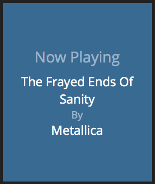

## Preview



## Description
Displays the currently playing song from pianobar.
pianobar is a CLI client for pandora.com

This is still a work-in-progress - everything works except for background art.

## Dependencies
Data is pushed to this widget from pianobar into Dashing's API.  As such, pianobar must be configured with the 'event_command' option in the pianobar config file.

1. Ensure that the following line is present in your pianobar config file (typically ~/.config/pianobar/config):  ```event_command = /Users/kjohnson/bin/eventcmd-examples/pianobar.rb```
2. Install the pianobar.rb file into blah

## Usage
To install this widget, copy the ```pianobar.coffee```, ```pianobar.scss``` and ```pianobar.html``` files into the ```widgets/pianobar/``` directory

To include the widget in a dashboard, add the following snippet to the dashboard layout file:
```
<li data-row="1" data-col="1" data-sizex="1" data-sizey="1">
  <div data-id="pianobar" data-view="Text"></div>
</li>
```
